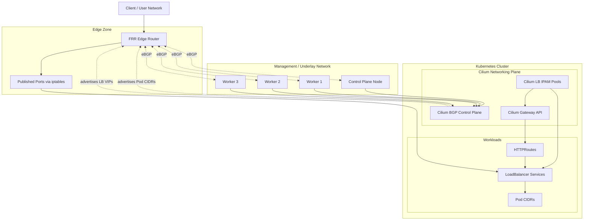

# Bare-Metal Kubernetes Networking with Cilium, BGP, FRR and Gateway API

This repository is a portfolio-style walkthrough of how I expose workloads from a bare-metal Kubernetes cluster without relying on cloud load balancers.

The pattern is built around:

- Cilium as CNI and kube-proxy replacement
- Cilium BGP Control Plane for Pod CIDR and `LoadBalancer` IP advertisement
- Cilium Gateway API for HTTP entrypoints
- FRR as the upstream edge router
- `iptables` on the router for selective north-south publishing

All examples are based on a real homelab setup, but the repository is fully sanitized. No real lab IPs, peer addresses or router details are published.

## Why This Project Exists

Most Kubernetes networking examples assume a cloud environment with managed load balancers. This repository focuses on a different problem:

How do you expose services cleanly on bare metal when you control the routers, the address pools and the edge publishing rules?

This repo documents that answer with reusable templates, routing examples and troubleshooting notes.

## Highlights

- advertises `LoadBalancer` VIPs over BGP without MetalLB
- advertises Pod CIDRs from Kubernetes nodes to an upstream FRR router
- uses dedicated Cilium IP pools for service allocation
- exposes HTTP apps through Cilium Gateway API
- selectively publishes services through router-level DNAT and SNAT
- keeps examples safe for public sharing by replacing all real addressing data

## High-Level Topology

## How the Design Works

The design splits responsibilities cleanly:

- East-west traffic is handled by Cilium.
- Service VIPs come from `CiliumLoadBalancerIPPool` resources.
- Kubernetes nodes peer with the upstream router over eBGP.
- Cilium advertises both Pod CIDRs and `LoadBalancer` IPs.
- FRR installs routes dynamically.
- The edge router exposes only selected applications through explicit NAT rules.

This gives you:

- deterministic service exposure
- better visibility into packet flow
- less manual route management
- a practical on-prem alternative to cloud-native ingress patterns

## Repository Structure

- `docs/architecture.md`: architectural decisions and traffic flow
- `docs/router-edge-nat.md`: north-south publishing through the router
- `docs/troubleshooting.md`: operational checks and failure scenarios
- `manifests/cilium/`: sanitized Cilium BGP and IPAM examples
- `manifests/gateway/`: sanitized Gateway API examples
- `manifests/services/`: sample `LoadBalancer` service definitions
- `router/frr/`: FRR sample configuration
- `router/iptables/`: NAT examples and helper script
- `scripts/`: small router-side BGP helper scripts

## Core Building Blocks

### LoadBalancer IP pools

Cilium allocates service VIPs from dedicated pools. This lets you separate application classes, for example:

- public-facing services
- internal-only service VIPs

Example:

- [manifests/cilium/loadbalancer-ip-pools.yaml](manifests/cilium/loadbalancer-ip-pools.yaml)

### BGP peering

Each Kubernetes node peers with the upstream FRR router. The node side advertises:

- Pod CIDRs
- `LoadBalancer` IPs

Examples:

- [manifests/cilium/bgp-peering-policy.yaml](manifests/cilium/bgp-peering-policy.yaml)
- [router/frr/frr.conf](router/frr/frr.conf)

### Gateway API

Cilium also acts as the Gateway API implementation, allowing a dedicated VIP to front multiple HTTP routes.

Examples:

- [manifests/gateway/gateway.yaml](manifests/gateway/gateway.yaml)
- [manifests/gateway/http-routes.yaml](manifests/gateway/http-routes.yaml)

### Edge NAT

Not every reachable VIP should be directly exposed. The edge router can front selected services with local ports and rewrite traffic toward cluster VIPs.

Examples:

- [router/iptables/example-rules.txt](router/iptables/example-rules.txt)
- [router/iptables/publish-service.sh](router/iptables/publish-service.sh)

## Typical Traffic Flows

### 1. Service published as `LoadBalancer`

1. A Kubernetes `Service` is created as `type: LoadBalancer`.
2. Cilium allocates a VIP from the configured pool.
3. Cilium advertises that VIP to the FRR router.
4. The router installs the route.
5. Clients reach the service through the advertised VIP.

### 2. HTTP application exposed through Gateway API

1. A `Gateway` gets a dedicated address from the IP pool.
2. `HTTPRoute` resources attach backend services.
3. Cilium programs the gateway datapath.
4. The router learns the gateway VIP over BGP.
5. Clients reach the application through the gateway address.

### 3. Service exposed through a router-local port

1. The router listens on a chosen local IP and TCP port.
2. `iptables` performs DNAT to the service VIP.
3. `SNAT` or `MASQUERADE` keeps return traffic symmetric.
4. The workload stays reachable without exposing raw internal service addresses to end users.

## What I Reused from the Real Lab

This repository is based on patterns actively used in a working cluster:

- Cilium BGP Control Plane
- multiple `LoadBalancer` IP pools
- FRR peering with bare-metal nodes
- Gateway API for application routing
- router-side NAT for selected services

What is intentionally not included:

- real IP addresses
- raw router configs copied from the lab
- direct `kubectl` output from the environment
- exact public service inventory

## Getting Started

1. Review the Cilium manifests under `manifests/cilium/`.
2. Replace placeholder ASNs, peer addresses and CIDRs with your own values.
3. Apply the Cilium resources.
4. Configure FRR using the example under `router/frr/`.
5. Create a `LoadBalancer` service or a `Gateway`.
6. If needed, publish selected services with the router helper script.

## Validation Checklist

- `kubectl get svc -A` shows `EXTERNAL-IP` values for `LoadBalancer` services
- `kubectl get ciliumloadbalancerippools`
- `kubectl get ciliumbgppeeringpolicies`
- `kubectl -n kube-system exec ds/cilium -- cilium status --verbose`
- `vtysh -c "show bgp summary"`
- `ip route`
- `iptables -t nat -S`

## Future Improvements

- dual-router HA with VRRP or ECMP
- BFD for faster convergence
- BGP community-based route control
- GitOps-managed router configuration
- a dedicated lab topology diagram with VLANs and edge zones
