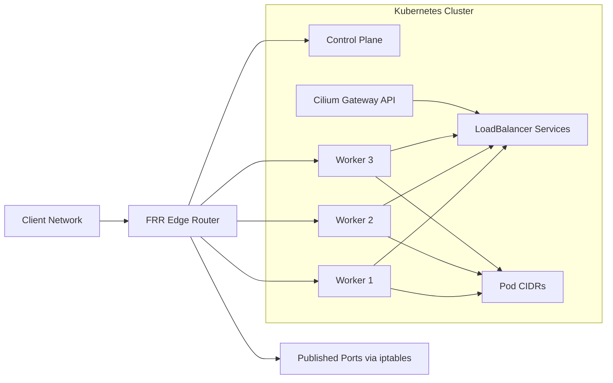

# Bare-Metal Kubernetes Networking with Cilium, BGP and FRR

This repository documents a bare-metal Kubernetes networking pattern built around:

- Kubernetes on private nodes
- Cilium as CNI, kube-proxy replacement and Gateway API implementation
- Cilium BGP Control Plane for advertising Pod CIDRs and `LoadBalancer` IPs
- FRR on an edge router
- `iptables` DNAT/SNAT on the router for selective north-south publishing

The content is inspired by a live homelab cluster, but all addresses and examples in this repository are sanitized. No production or lab IPs are published here.

## What This Repository Shows

- how to advertise Kubernetes `LoadBalancer` IPs over BGP without MetalLB
- how to expose Pod CIDRs and service VIPs to an upstream router
- how to combine Cilium Gateway API with dedicated `LoadBalancer` pools
- how to publish selected services through an edge router with `iptables`
- how to debug routing, BGP sessions, service advertisement and edge NAT

## Topology

## Networking Model

The model documented here follows this split:

- East-west pod networking is handled by Cilium.
- Kubernetes services use Cilium `LoadBalancer` IPAM from dedicated pools.
- Cilium BGP Control Plane advertises Pod CIDRs and `LoadBalancer` IPs to FRR.
- The edge router learns those routes dynamically and forwards traffic to the cluster.
- Public publishing is selective and explicit: only chosen services are exposed with `iptables` DNAT/SNAT on the router.

This is useful when you want:

- full control over ingress paths
- on-prem style routing instead of cloud LBs
- static or semi-static service VIPs
- a clean separation between cluster networking and edge publishing

## Repository Layout

- `docs/architecture.md`: design decisions and traffic flow
- `docs/router-edge-nat.md`: how the edge router publishes selected services
- `docs/troubleshooting.md`: checks for Cilium, BGP, LB IPs and router state
- `manifests/cilium/`: sanitized Cilium networking resources
- `manifests/gateway/`: sanitized Gateway API examples
- `manifests/services/`: sample `LoadBalancer` services
- `router/frr/`: FRR examples for the upstream router
- `router/iptables/`: example `iptables` rules used to publish services
- `scripts/`: helper scripts for FRR neighbor lifecycle

## Core Components

### 1. LoadBalancer IP pools

Cilium assigns service VIPs from dedicated pools, for example:

- one pool for internal apps
- one pool for edge-facing apps

See [manifests/cilium/loadbalancer-ip-pools.yaml](manifests/cilium/loadbalancer-ip-pools.yaml).

### 2. BGP peering

Each cluster node peers with the edge router using eBGP. The node side advertises:

- Pod CIDRs
- `LoadBalancer` IPs

See [manifests/cilium/bgp-peering-policy.yaml](manifests/cilium/bgp-peering-policy.yaml) and [router/frr/frr.conf](router/frr/frr.conf).

### 3. Gateway API

Cilium implements Gateway API and can front selected workloads with a dedicated VIP from the pool.

See [manifests/gateway/gateway.yaml](manifests/gateway/gateway.yaml) and [manifests/gateway/http-routes.yaml](manifests/gateway/http-routes.yaml).

### 4. Edge NAT

When a service should be reachable from another subnet or from a user-facing router IP, the edge router can expose it with targeted DNAT/SNAT.

See [router/iptables/publish-service.sh](router/iptables/publish-service.sh).

## Example Flows

### LoadBalancer service

1. A `Service` is created with `type: LoadBalancer`.
2. Cilium allocates an IP from a pool.
3. Cilium BGP advertises that IP to FRR.
4. The edge router installs the route.
5. Clients reach the service VIP directly.

### Gateway API

1. A `Gateway` receives a dedicated VIP.
2. `HTTPRoute` resources bind workloads behind the gateway.
3. Cilium programs Envoy and BPF service handling.
4. FRR learns the gateway VIP over BGP.
5. Clients reach the application through the gateway IP.

### Published service through edge NAT

1. The router receives traffic on a local address and port.
2. `iptables` DNAT rewrites the destination to a cluster `LoadBalancer` IP.
3. Return traffic is normalized with `SNAT` or `MASQUERADE`.
4. The service stays reachable without exposing every VIP directly to users.

## Design Notes

- The cluster can use overlay routing internally while still advertising VIP reachability north-south through BGP.
- BGP is used here for route distribution, not for replacing all cluster networking primitives.
- Edge NAT remains useful when you want stable user-facing entrypoints that differ from service VIPs.
- This pattern is especially practical in homelabs, private datacenters and small bare-metal environments.

## Getting Started

1. Review the sanitized Cilium manifests under `manifests/cilium/`.
2. Adjust placeholder ASNs, peer addresses and CIDRs for your own environment.
3. Apply the Cilium resources.
4. Configure FRR with the example in `router/frr/frr.conf`.
5. Create `LoadBalancer` services or a `Gateway`.
6. If required, publish selected services with the example router scripts.

## Validation Checklist

- `kubectl get svc -A` shows `EXTERNAL-IP` values for `LoadBalancer` services
- `kubectl get ciliumloadbalancerippools`
- `kubectl get ciliumbgppeeringpolicies`
- `cilium status --verbose`
- `vtysh -c "show bgp summary"`
- `ip route`
- `iptables -t nat -S`

## Future Extensions

- dual-router HA with ECMP or VRRP
- BFD for faster failure detection
- BGP communities and policy filtering
- Cilium L2 announcements for non-BGP segments
- GitOps-managed router config generation
